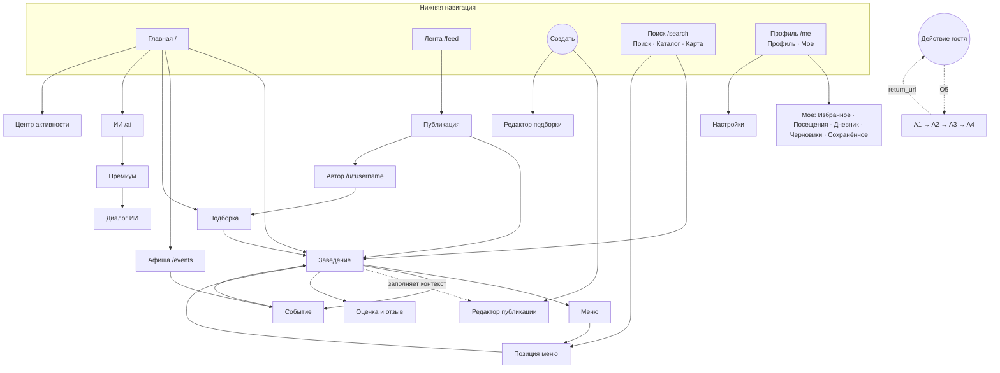

# Структура фронта: страницы и пользовательские пути (пользовательский сервис)

> Черновик от 2026-09-21 (задача `.ai/tasks/0002`). Охват: только пользовательский сервис (`materials/tz/b2c.md`), мобильный приоритет 390–430 px, плюс десктопная раскладка. ЛК ресторана, ЛК Партнёра и админ-панель — отдельные интерфейсы (`b2c.md` §2.5, §29) и здесь не разбираются.
> Решения владельца от 2026-09-21: охват — только пользовательский сервис; предложенные маршруты вне ТЗ принимаются как есть; мок и мобильный, и десктопный; данные — два города, фото из референсов.
> Источник истины — ТЗ. Референсы из `materials/design/` дают только стиль и компоненты. Референсы, как и `code/prototype`, — примерный вид, а не спецификация (решение владельца 2026-09-21). Дизайн-система — та, что собрана в этом репозитории (`design-system.html`, `scaffold/src/design-system`). Разобраны все 10 референсов.
> Пометка `(assumption)` — в ТЗ этого нет, это моё предположение, ждёт подтверждения.

## 1. Каркас (оболочка)

| Элемент | Что в нём | Источник |
|---|---|---|
| Нижняя навигация | **Главная · Лента · Создать · Поиск · Профиль**. «Создать» открывает панель, а не страницу. Каталога и Избранного в нижней навигации нет | §4.1, §4.4 |
| Верхняя панель | Активный город (переключатель), вход в Центр активности (`/activity`), вход в Поиск | §6.1, §7.1, §19 |
| Десктоп (в моке — да, решение владельца) | Те же корневые разделы; нижняя навигация становится верхней или боковой (вариант выбираем при сборке оболочки, `(assumption)`). Старую структуру «Каталог/Избранное» не возвращать. Референсы десктопа: `home-desktop.png`, `user-cabinet.png` | §25А.2 |
| Подвал | Ссылки на юридические документы, помощь. Ссылки «Для заведений» и «Партнёрам» ведут наружу, в другие контуры | референс, `(assumption)` |
| Состояние навигации | «Назад» восстанавливает запрос, фильтры, область карты, прокрутку и сеанс Ленты; корневые вкладки хранят состояние в сеансе | §26.3 |

## 2. Карта страниц

Колонка «Мок»: **P0** — нужна в кликабельном моке, без неё пути не проходятся; **P1** — нужна для полноты, делаем следом; **P2** — можно заглушкой; **—** — вне первой версии, в мок не берём.
Колонка «Доступ»: **Г** — открыта гостю; **А** — при действии запускается авторизация (§5.1).

### 2.1. Корневые разделы

| ID | Страница | Маршрут | Доступ | Мок | Что на странице | Источник |
|---|---|---|---|---|---|---|
| H1 | Главная | `/` | Г | P0 | Заголовок, город, Центр активности, поиск, 4–6 быстрых фильтров; модули: Куда сходить, Рекомендуем вам, Авторы, Подборки, Что нового у заведений, Афиша, От посетителей, Новые места, ИИ Премиум, Недавно просмотренное (не обязательно все сразу) | §7.1 |
| F1 | Лента | `/feed` `(assumption: маршрут в ТЗ не назван)` | Г | P0 | Вкладки **Для вас / Подписки** × **Все / Авторы / Заведения**; карточки: публикация пользователя, официальный контент заведения (визуально отличается), подборка; индикатор «Есть новые публикации» | §4.3, §12 |
| S1 | Поиск | `/search` | Г | P0 | Режимы **Поиск / Каталог / Карта** в одном контексте; поле, автодополнение, фильтры (кухня, тип, район/местность/метро, цена, «Открыто сейчас»), «Рядом со мной» | §4.5, §8 |
| P1 | Профиль (свой) | `/me` | А | P0 | Два режима **Профиль / Мое** | §4.6 |
| C0 | Создать (панель) | без маршрута | А | P0 | Выбор: Публикация → редактор; Подборка → редактор | §4.4 |

### 2.2. Публичные объекты (гость видит без регистрации)

| ID | Страница | Маршрут | Мок | Что на странице | Источник |
|---|---|---|---|---|---|
| V1 | Заведение | `/venue/:slug-or-id` | P0 | 15 блоков по порядку: фото → название/тип/кухня → статус, оценка, цена → Избранное, подписка, Поделиться, маршрут/телефон/сайт/бронирование → О заведении → Меню → Контент заведения → События → Отзывы → Фото посетителей → Публикации посетителей → контакты и часы → Похожие → ИИ Премиум → запрос управления | §9.1 |
| V2 | Меню заведения | `/venue/:id/menu` | P0 | Разделы меню, позиции с ценой и доступностью; алкогольных позиций нет | §10, §8.4 |
| V3 | Позиция меню | `/venue/:id/menu/:menuItemId` | P0 | Официальные данные, фото посетителей, публикации по позиции, похожие блюда и где ещё есть, ИИ Премиум | §10.4 |
| E1 | Афиша | `/events` | P0 | Сегодня / Завтра / Выходные / Дата; фильтры: категория, место, стоимость, статус | §11.2 |
| E2 | Событие | `/event/:id` | P0 | Даты проведения, стоимость (6 видов), статус, одно заведение, внешние действия (Зарегистрироваться, Купить билет, Забронировать, Подробнее), Сохранить | §11 |
| PO1 | Публикация | `/post/:id` | P0 | Текст, фото, привязка к заведению/позиции/событию, отметка «нравится», комментарии, сохранение, Поделиться | §13, §14 |
| U1 | Авторский профиль | `/u/:username` | P0 | Аватар, имя, @username, «О себе», число подписчиков, Подписаться; вкладки Публикации / Обзоры / Фото / Подборки. Закрытый профиль — отдельное состояние | §15 |
| K1 | Подборка | `/collection/:id` | P0 | Список заведений с заметками автора, порядок авторский; редакционная подписана «Редакция «Местами вкусно»» | §17 |
| K0 | Подборки (хаб) | `/collections` `(assumption: в ТЗ есть только `/collection/:id`)` | P0 | Поиск по подборкам, чипсы поводов, главная редакционная подборка, разделы «по поводу», «с утра», «красивый вечер», «новое», «по вкусу», «по атмосфере», «Выбор редакции», «Популярно сейчас»; баннер ИИ Премиум. Нужна: на Главной у модуля «Подборки» есть «Смотреть все», а в референсе «Подборки» — отдельная страница | §7.1, §17.2 |
| S2 | Каталог / Карта | внутри `/search` | P0 | Режимы Поиска: каталог списком, карта с метками, кластерами, превью и «Искать в этой области»; у карты всегда есть список | §8.6 |

### 2.3. Авторизация и первичная настройка

Маршруты для этого блока в ТЗ не названы. `(assumption)`: один поток `/auth`, который открывается поверх текущей страницы и по завершении возвращает на `return_url`.

| ID | Шаг | Мок | Что | Источник |
|---|---|---|---|---|
| A1 | Вход / регистрация | P0 | Только email, **без пароля**; согласия; проверка возраста 14+ `(assumption: способ проверки не описан)` | §5.3, §5.8 |
| A2 | Ввод кода | P0 | Одноразовый код, таймер повторной отправки, «Изменить email» | §5.4 |
| A3 | Настройка профиля | P0 | Имя, уникальный @username, аватар (необязательно), «О себе», видимость профиля (публичный / закрытый) | §5.5, §5.6 |
| A4 | Готово | P0 | Возврат в исходный объект, отложенное действие завершено | §5.2 |
| A5 | Юридическая настройка первой публичной публикации | P1 | Лицензия на публичный контент, согласие на изображение и голос, согласие на распространение (если применяется) — один раз | §13А |

### 2.4. Личное («Мое») и настройки

| ID | Страница | Маршрут | Мок | Что | Источник |
|---|---|---|---|---|---|
| M1 | Мое (обзор) | `/me` (режим «Мое») | P0 | Точки входа в подразделы библиотеки | §18 |
| M2 | Избранное | `/me/favorites` | P0 | Избранные заведения; приватно по умолчанию | §18, §20.2 |
| M3 | Посещения | `/me/visits` | P0 | Приватные ручные факты; после — предложение Оценки/Отзыва/Публикации | §16.3, §16.4 |
| M4 | Дневник | `/me/diary` | P1 | Приватные записи (`visibility=private`), заведение необязательно | §4.4, §13.1 |
| M5 | Черновики | `/me/drafts` | P1 | Публикации и подборки, автосохранение, статус модерации | §26.2, §13.4 |
| M6 | Сохранённое | `(assumption: /me/saved)` | P1 | Публикации, подборки, события | §18 |
| M7 | Оценки и отзывы | `(assumption: /me/reviews)` | P1 | Мои оценки и отзывы, правка | §16 |
| M8 | Недавно просмотренное | `(assumption: /me/recent)` | P2 | Список | §18 |
| AC1 | Центр активности | `/activity` | P1 | Вкладки Все / Активность / Обновления / Системные | §19.1 |
| ST1 | Настройки | `/settings` | P1 | Приватность (видимость профиля и публикаций по умолчанию, заблокированные, скрытые авторы и заведения, персонализация, разрешения ИИ, история), уведомления (5 крупных категорий), аккаунт (смена email, выход, запрос на удаление), запросы по персональным данным | §20, §19.3, §5.7, §20А |

### 2.5. Создание контента

Маршруты не названы. `(assumption)`: полноэкранные редакторы поверх текущей страницы.

| ID | Экран | Мок | Что | Источник |
|---|---|---|---|---|
| CR1 | Редактор публикации | P0 | Текст, фото, заведение (обязательно для публичной), позиция меню, событие, Посещение, контекст Оценки, видимость (всегда заметна), комментарии вкл/выкл; автосохранение. Входы: «Создать», заведение, позиция, событие, Посещение | §13 |
| CR2 | Редактор подборки | P1 | Публичная/приватная, заведения с заметками, порядок, без дублей | §17.1 |
| CR3 | Оценка и отзыв | P1 | Оценка 1–5, текст, фото; один активный отзыв на пару «пользователь × заведение»; открывается из заведения или Посещения | §16 |
| CR4 | Добавление Посещения | P1 | Дата не в будущем, событие необязательно | §16.3 |

### 2.6. Премиум и ИИ

| ID | Страница | Маршрут | Мок | Что | Источник |
|---|---|---|---|---|---|
| PR1 | Премиум | `/premium` | P1 | Возможности, условия, покупка (только 18+), состояния подписки, отмена автопродления, история платежей. Цены и периоды не утверждены — в мок только заглушки (`(assumption)`) | §24, §25 |
| AI1 | ИИ (вход) | `/ai` | P1 | Для Премиум — запрос и подсказки; для гостя и бесплатной версии — **только контекстное предложение подписки**, ни квоты, ни частичного ответа | §23.1 |
| AI2 | Диалог с ИИ | `/ai/chat/:conversationId` | P1 | Короткий вывод + карточки объектов + причины + компромиссы + кнопки действий + подсказки; сравнение 2–4 заведений; два отдельных разрешения на данные. Публичной ссылки на диалог нет | §23.5, §23.6, §22 |
| PR2 | Оплата | внешний провайдер | P2 | Заглушка «переход к провайдеру» → возврат на `/premium` с результатом; реквизитов карт мы не храним | §25, §25Б |

### 2.7. Оверлеи (панели и окна без своего маршрута)

| ID | Оверлей | Мок | Источник |
|---|---|---|---|
| O1 | Выбор города | P0 | §6.1 |
| O2 | Предложение сменить город (если устройство в другом городе; меняет только явное действие) | P2 | §6.2 |
| O3 | Пояснение перед запросом геолокации; отказ не ломает продукт | P1 | §6.4 |
| O4 | Фильтры Поиска | P0 | §8.5 |
| O5 | Авторизация при значимом действии (запускает поток A1–A4) | P0 | §5.1 |
| O6 | Контекстное предложение Премиум (`premium_intent`) | P0 | §23.1, §25 |
| O7 | Поделиться | P1 | §22 |
| O8 | Комментарии к публикации, один уровень ответов | P1 | §14.1 |
| O9 | Жалоба (пользовательский контент) и жалоба на данные заведения (неверные часы, адрес, закрытие) — две разные | P1 | §21.2, §21.3 |
| O10 | Меню публикации: не интересно, показывать меньше, скрыть автора, скрыть заведение, заблокировать | P2 | §12.4 |
| O11 | Запрос управления заведением | P2 | §9.1 п. 15 |
| O12 | Подтверждение действия (удалить, отписаться, сделать приватной) — добавлен дизайнером | P1 | `screens-without-reference.md` §7 |
| O13 | Выбор объекта (заведение, позиция, событие, Посещение) в редакторе — добавлен дизайнером | P1 | `screens-without-reference.md` §7 |
| O14 | Данные, на которые опирался ответ ИИ — добавлен дизайнером | P1 | `screens-without-reference.md` §7 |

### 2.8. Системные и статические страницы

| ID | Страница | Мок | Источник |
|---|---|---|---|
| X1 | 404 | P0 (есть референс) | `materials/design/not-found-404.png` |
| X2 | Блокирующая ошибка, нет сети | P1 | §26.1, §26.4 |
| X3 | Юридические документы: пользовательское соглашение, политика конфиденциальности, согласие на ПД, маркетинговое согласие, согласие на распространение ПД, оферта Премиум, правила сервиса, правила рекомендаций | P2, один шаблон | `materials/legal/b2c/*`; маршруты `(assumption)` |
| X4 | Помощь / Поддержка / Обратная связь / Как это работает / Вопросы и ответы | P2, один шаблон | референс (подвал); в ТЗ не описаны `(assumption)` |
| X5 | О нас / Контакты / Реквизиты | P2, один шаблон | референс (подвал); реквизиты ООО «ВСЕМ» — `materials/legal/*` |

### 2.9. Состояния, которые нужно нарисовать (сквозные)

Для значимых экранов: первичная загрузка, загружено, пусто, частично, обновляется, устарело, из кэша без сети, исправимая ошибка, блокирующая ошибка (§26.1). Отдельно:
- Заведение: статусы «скоро открытие», «временно закрыто», «закрыто навсегда», «приостановлено» — операционные кнопки отключены (§9.3).
- Событие: запланировано, места закончились, перенесено, отменено, завершено (§11.1).
- Позиция меню: доступна, временно недоступна, удалена (§10.3).
- Поиск без результатов: «пусто» отличается от «ошибка»; для блюд — «Не нашли это блюдо в опубликованных меню» (§8.8).
- Профиль: публичный / закрытый (§15.2).
- Публикация: черновик, на модерации, опубликовано, запрошены изменения, отклонено, удалено (§13.4).
- Компоненты: по умолчанию, нажатие, фокус, отключено, загрузка, выбрано, ошибка (§25А.3).

### 2.10. Не берём в мок (первая версия не включает)

Личные сообщения (§27В.6), упоминания, комментарии к контенту заведения и событиям, официальный ответ ресторана на отзыв, карты Избранного и подборок, устройства и сеансы, экспорт данных, видео и истории, внутреннее бронирование (§28.2–28.3). ИИ-подборки и анализ дневника — после первой версии (§23.2).

## 3. Пользовательские пути

Каждый путь — по сквозным сценариям приёмки §30 (номер сценария в скобках). Страницы указаны по ID из раздела 2.

### J1. Гость: знакомство без регистрации (§30.1)
Главная (H1) → быстрый фильтр или поиск (S1) → заведение (V1) → меню (V2) → позиция (V3).
Правило: стены регистрации нет; регистрация только при значимом действии (§5.1). Ссылка из шеринга открывает сам объект, а не Главную (§22).

### J2. Поиск блюда → заведение (§30.2, §30.3)
H1 или S1 → запрос «пенне» → результаты по блюдам (позиция, заведение, текущая цена или «Цена не указана», оценка, район, расстояние, фото) → V3 → V1.
Проверить в моке: алкогольных позиций нет в результатах и автодополнении, при этом бар находится как заведение.
Ветка «ничего не нашли»: пустой результат → способы ослабить фильтры → необязательное предложение ИИ Премиум (O6).

### J3. Гость сохраняет в Избранное (§30.4)
V1 → «Избранное» → авторизация (O5 → A1 email → A2 код → A3 профиль → A4) → возврат на V1, заведение уже в Избранном → видно в M2.
Правило: действие сохраняется как отложенное (`action_type`, `object_id`, `return_url`, `expires_at`), §5.2.

### J4. Каталог и карта (§30.12)
S1 → режим «Каталог» → фильтры (O4) → переключение на «Карту» → метка → превью → V1 → «Назад» → фильтры, запрос и область карты сохранены.
Ветка «Рядом со мной»: пояснение (O3) → разрешение или отказ; отказ не блокирует поиск, предлагается опорная точка.

### J5. Афиша и событие (§30.11)
H1 (модуль «Афиша») или E1 → Сегодня/Выходные/Дата → E2 → «Сохранить» (при необходимости вход) → внешнее действие «Зарегистрироваться» → напоминание.
Ветка: событие перенесено или отменено → уведомление в `/activity` (вкладка «Системные»). Сохранено ≠ Посещение.

### J6. Лента и социальные действия (§30.7)
F1 → «Для вас / Подписки» × «Все / Авторы / Заведения» → PO1 → отметка «нравится», комментарий (O8), сохранение, подписка на автора U1 (каждое запускает O5 у гостя) → «Назад» → сеанс Ленты восстановлен.
Ветка: закрытый профиль автора — переход из публикации показывает закрытый профиль (§15.2).

### J7. Публикация (§30.6, §30.8)
Вариант а — общий: «Создать» (C0) → Публикация (CR1) → заведение → позиция/событие/Посещение → видимость → «Опубликовать».
Вариант б — из заведения: V1 → «Написать публикацию» → CR1 с уже заполненным заведением (пользователь видит и правит контекст).
Первая публичная публикация: A5 (один раз). Дальше: статус «на модерации» → в M5 и в моей ленте.
Приватный дневник: CR1 с видимостью «только для меня» → M4; в Ленту и рекомендации не попадает.
Автосохранение: закрыл на середине → черновик в M5.

### J8. Посещение → Оценка → Отзыв (§30.9)
V1 → «Я был здесь» (CR4, дата не в будущем) → M3 → предложение Оценки/Отзыва/Публикации (все необязательны) → CR3.
Правило: одна активная Оценка и один Отзыв на пару «пользователь × заведение»; повторное Посещение допустимо и новый отзыв не создаёт. Посещение приватно и не показывается ресторану.

### J9. Подборка (§30.8)
«Создать» (C0) → Подборка (CR2) → добавить заведения с заметками, порядок → публичная/приватная → K1 → Поделиться.
Чужая подборка: K1 → «Сохранить» → в M6 как ссылка на оригинал, не копия.

### J10. ИИ Премиум (§30.14–16)
Бесплатная версия: H1 (модуль «ИИ»), V1 (блок «ИИ Премиум») или пустая выдача → O6 → PR1 → покупка (18+) → возврат в исходный сценарий по `premium_intent` → AI2.
Внутри AI2: запрос → короткий вывод + карточки + причины + компромиссы → «Сравнить» 2–4 заведения → два переключателя разрешений на личные данные (`ai_personal_library_access`, `ai_private_text_access`; второй по умолчанию выключен).
Бесплатному пользователю генерация недоступна вовсе: только предложение подписки.
После окончания Премиум: старые диалоги читаются, новые сообщения блокируются предложением подписки (§23.8).

### J11. Приватность и аккаунт (§30.5, §30.17)
P1 → ST1 → видимость профиля (публичный/закрытый) → видимость публикаций по умолчанию → персонализация вкл/выкл (Главная и Поиск остаются рабочими) → скрытые и заблокированные → запрос на удаление аккаунта (учёт активного Премиум).
Сам запрос на удаление аккаунта и юридический запрос субъекта ПД — два разных сценария (§20А).

### J12. Жалоба (§21)
Любая публикация, отзыв или комментарий → O9 (жалоба на контент) → категория, описание → статус жалобы у пользователя.
Неверные часы или закрытие заведения → O9 (жалоба на данные заведения) — отдельный поток.
Результат модерации и статус апелляции видны в `/activity` → «Системные».

### J13. Сбой (§30.18)
Обрыв сети во время публикации → черновик сохранён → баннер «нет сети» → повтор загрузки каждого файла → отправка. Сбой карты, ИИ или платёжного провайдера не ломает остальные страницы.

## 4. Карта связей (Mermaid)

## 5. Расхождения референсов с ТЗ (решаются в пользу ТЗ)

Проверено только по трём открытым референсам.

| Референс | Что нарисовано | Что в ТЗ |
|---|---|---|
| `auth-flow.png` | Регистрация по email **и паролю**, поле промокода, «Премиум активирован до…» на финальном экране | Вход по коду на email без пароля (§5.3); промокоды пользователя и промокод Партнёра — разные сущности (§25); пробный период Премиум — гипотеза, не требование (§24.3) |
| `home-mobile.png` | Нижняя навигация Главная · Каталог · Поиск · Избранное · Профиль | Главная · Лента · Создать · Поиск · Профиль (§4.1) |
| `user-cabinet.png` | Кабинет с боковым меню «Обзор / Профиль / Избранное / Посещённые места / Мои отзывы / Тариф и подписка / Настройки», тариф «Free», верхнее меню «Каталог · Афиша · Подборки · Тарифы» | Профиль = «Профиль / Мое» (§4.6); отдельного «Тарифа Free» нет — есть бесплатная версия и Премиум (§24); «Тарифы» относятся к подписке ресторанов, не пользователей `(assumption)` |

### 5.1. Остальные семь референсов: что показывают и как ложатся на карту

| Референс | Покрывает | Что нового или спорного |
|---|---|---|
| `home-desktop.png` | H1 на десктопе: hero с поиском, быстрые фильтры, модули Куда сходить, Подборки, Что нового, Афиша с вкладками Сегодня/Завтра/Выходные, баннер ИИ, Рекомендуем вам | Нет модулей Авторы, От посетителей, Недавно просмотренное (§7.1 не требует все сразу). В шапке сердце вместо Центра активности. В подвале кнопки App Store / Google Play — в ТЗ только PWA (§26.4), в мок не берём |
| `catalog.png` | S1 в режиме «Каталог» и «Карта» | Отдельная страница «Каталог заведений» с заголовком и счётчиком; чипсы типа заведения (Рестораны, Кафе, Бары, Кофейни, Пекарни, Гастробары); быстрые чипсы; панель фильтров (Кухня, Средний чек, Район, Рейтинг, Особенности, Открыто сейчас), сортировка «По популярности», переключатель Список/Карта, выбранные фильтры со сбросом; бейджи «Выбор редакции», «Сегодня событие», NEW; «Показать ещё» и нумерация страниц; карта со списком слева, «Искать в этой области», превью заведения. **Не в ТЗ:** фильтр «Рейтинг», сортировка, бейдж «Выбор редакции» у заведения |
| `collections.png` | K0, K1 | Хаб подборок (см. K0). **Не в ТЗ:** раздел «Гастрономические маршруты» (маршрут из нескольких точек с километражем и длительностью): в ТЗ «продвинутые маршруты» — после первой версии (§23.2), редакционная подборка — обычный список заведений (§17.2). «Тарифы» в верхнем меню — см. вопрос 9 |
| `events-list.png` | E1 | Поиск по событиям; чипсы Сегодня / Завтра / Выходные / На этой неделе / Выбрать дату (календарь); категории (Ужины, Дегустации, Бранчи, Музыка, Гостевые шефы, Мастер-классы); разделы: Сегодня в городе, Выбор редакции, На выходных, Скоро, «События в ваших любимых местах» (на основе Избранного самого пользователя — допустимо, §7.5); баннер ИИ; нумерация страниц. Бейджи «Бесплатно», NEW. **Не в ТЗ:** «Осталось мало мест» (ТЗ знает только `sold_out`), «На этой неделе» |
| `event-page.png` | E2 | Хлебные крошки; hero с датой, временем, местом, ценой; кнопки Записаться / Сохранить / Поделиться; вкладки О событии, Программа, Что входит, Фото, Заведение, Информация; боковая карточка с датой, временем, адресом, ценой, форматом; «Спросить AI о событии» (Премиум, §23.2 — допустимо); «Важно знать» (возраст, отмена); «Организатор» (заведение); «Ещё в этом заведении», «Вам может понравиться», «Ещё в этот день»; «Как добраться» с картой. **Не в ТЗ:** «Добавить в календарь» — экспорт в календарь после первой версии (§28.2); «Записаться» — в ТЗ внешние действия (Зарегистрироваться, Купить билет, Забронировать, Подробнее), клик не считается регистрацией (§11.5); состав контента события (программа, «что входит», меню вечера) в ТЗ пользовательского сервиса не расписан `(assumption)` |
| `venue-card.png` | V1 (десктоп) | Галерея (+N фото), название, тип/кухня/район, чек, «Открыто до», расстояние, оценка и число отзывов, бейджи, действия Сохранить / Маршрут / Поделиться / Я здесь был; вкладки О месте, Меню, Афиша, Отзывы, Фото, Информация; боковая колонка (часы, адрес, телефон, сайт, соцсети, карта, «Построить маршрут»); превью меню с категориями и поиском по меню; «Что происходит здесь»; «Посещение» («Вы были здесь», «Оставить отзыв»); «Похожие места», «Ещё рядом». Порядок блоков в мобильной версии — по §9.1. **Расхождения с ТЗ:** (а) «Что говорят гости» показывает текст сводки ИИ с пометкой Premium — ТЗ запрещает бесплатной версии тизер сводки ИИ (§23.1), для гостя и бесплатной версии показываем только контекстное предложение; (б) «Настроение гостей» (проценты по Кухне, Сервису, Атмосфере, Чистоте, Уюту) и «Доверие к отзывам — высокое» — в ТЗ только Оценка 1–5 (§16.1), в мок не берём |
| `not-found-404.png` | X1 | 404 с крупным «404», кнопками «На главную» / «Открыть каталог», полем поиска и блоком «Возможно, вам подойдет» — берём как есть. «Открыть каталог» ведёт в `/search` в режиме «Каталог» |

### 5.2. Общее по референсам
- **Верхнее меню десктопа** в референсах: Каталог · Афиша · Подборки · Тарифы, плюс сердце (Избранное) и Войти / Регистрация. ТЗ: корневые разделы те же, что в нижней навигации (Главная · Лента · Создать · Поиск · Профиль), а Каталог и Избранное как отдельные продуктовые разделы из-за десктопной раскладки возвращать нельзя (§25А.2). Дефолт: десктопная шапка = Главная · Лента · Поиск (с режимом «Каталог») · Афиша · Подборки `(assumption: Афишу и Подборки выносим ссылками как в референсах)`, справа — город, Центр активности, Создать, аватар; «Тарифы» — см. вопрос 9.
- **Подвал** в референсах: Сервис, Помощь, Документы, Компания. Содержит «Блог», «Отзывы», «Отказ от ответственности» — в ТЗ и `materials/legal/b2c/` таких страниц нет (см. вопрос 10).
- **Состав карточки заведения** в каталоге: фото, сердце, название, кухня, район, чек, оценка (число отзывов), расстояние, бейджи. Совпадает с §8.3.

Композицию экранов без референса (мобильная и десктопная раскладка, компоненты, состояния, недостающие компоненты) см. `screens-without-reference.md` (задача 0003).

## 6. Решения и открытые вопросы

Решено владельцем 2026-09-21:
1. Охват — только пользовательский сервис; остальные контуры отдельными задачами позже.
2. Маршруты вне ТЗ (`/feed`, поток авторизации, редакторы, `/me/saved`, `/me/reviews`, `/me/recent`, юридические страницы) — принимаются как есть.
3. Мок — мобильный (390–430 px) и десктопный.
4. Данные мока — два города, фото из `materials/design/`. Дефолт по количеству заведений и авторов не задан `(assumption: набор достаточный, чтобы пройти все пути J1–J13)`.

Остаются открытыми (пока действуют дефолты, отмеченные ниже):
5. Премиум: цены и периоды не утверждены (§24.3). Дефолт: в моке заглушки без цифр.
6. Проверка возраста 14+ при регистрации: в ТЗ не описана. Дефолт: чекбокс «мне есть 14 лет» в A1.
7. Помощь / Поддержка и подвал: дефолт — одна страница-заглушка X4.
8. ~~Референсы не разобраны~~ — разобраны (раздел 5.1).
9. «Тарифы» в верхнем меню референсов. Владелец: подумать, как лучше для UI/UX. **Рекомендация:** пункт из основной навигации убрать. Почему: в ТЗ у пользователя нет «тарифов» (есть бесплатная версия и Премиум, §24), тарифная лестница относится к ресторанам (`materials/legal/restaurant/tariff-terms.md`), а слово в общей шапке смешивает контуры (§29). Вход в Премиум — пункт в меню аккаунта, карточка в «Профиле» и контекстные предложения (O6). Ждёт подтверждения.
10. Подвал. Владелец: подумать. **Рекомендация:** на десктопе четыре колонки как в референсе; на мобильном — раскрывающиеся секции, как в `home-mobile`. Убрать «Блог» и «Отзывы» (нет в ТЗ), «Избранное» и «Каталог заведений» вести в `/me/favorites` и `/search` (режим «Каталог»), «Отказ от ответственности» убрать до решения юриста (в `materials/legal/b2c/` такого документа нет), «Для заведений» и «Партнёрам» — внешние ссылки на другие контуры. Остальное — заглушки по шаблону X4/X5. Ждёт подтверждения.
11. Раздел «Гастрономические маршруты» и бейдж «Выбор редакции» у заведения. Владелец спросил, почему не берём. **Ответ:** прямого запрета в ТЗ нет. Я исключил по двум основаниям: (а) критерий готовности §32 — не добавлять функции «на будущее» без отдельного решения, а «продвинутые маршруты» в ТЗ отнесены после первой версии (§23.2, речь про ИИ, но сама сущность «маршрут из нескольких точек» в модели данных не описана §3); (б) редакционная подпись допустима только у редакционной подборки (§17.2), а бейдж на самом заведении может выглядеть как редакционная рекомендация без описанного процесса, тогда как §17.2 запрещает скрыто продавать такое размещение. Для мока, где важно посмотреть расположение блоков, оба элемента можно показать как статичные макеты с пометкой «вне ТЗ». **Ждёт решения:** показывать ли их в моке?
12. Сводка «Что говорят гости» и «Настроение гостей» на карточке заведения — **решено (2026-09-21): не берём**, вместо них блок «ИИ Премиум» по §9.1 п. 14.
13. Фото — **решено (2026-09-21): заглушки** нужных пропорций. Главное — кликабельность и расположение блоков.

## 7. Технические требования к моку (решение владельца 2026-09-21)

- Проект собирается в `code/design-scaffold/scaffold`. **Продукт — на index (`/`)**; текущая витрина дизайн-системы переезжает на `/design-system`, страница анимаций остаётся на `/motion`.
- Всё кликабельно: можно проходить пути J1–J13 и смотреть расположение блоков.
- Анимации из дизайн-системы работают, код качественный и оптимизированный: инструменты от дешёвого к дорогому, токены движения, чек-лист плавности на телефонах, ленивые чанки. Этот пункт вписан в критерии приёмки задач 0004–0014.
